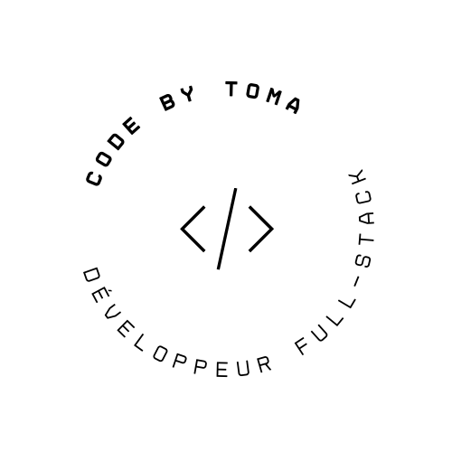

---------------------

Je suis un développeur passionné basé en Île-de-France. Actuellement étudiant en Développement informatique à Ensitech, je suis spécialisé dans le développement Full-Stack, ainsi que dans l'intégration de solutions innovantes.

* 🌍  Basé à Paris
* 🖥️  Vous pouvez consulter mon portfolio ici -> [CHANG Toma](https://www.codebytoma.me/)
* ✉️  Vous pouvez me contacter à cette adresse -> [toma11chang@gmail.com](mailto:toma11chang@gmail.com)

### Compétences

### Réseaux sociaux

 <a href="https://www.codepen.io/CHANG-Toma" target="_blank" rel="noreferrer"> <picture> <source media="(prefers-color-scheme: dark)" srcset="https://raw.githubusercontent.com/danielcranney/readme-generator/main/public/icons/socials/codepen-dark.svg" /> <source media="(prefers-color-scheme: light)" srcset="https://raw.githubusercontent.com/danielcranney/readme-generator/main/public/icons/socials/codepen.svg" />  </picture> </a> <a href="https://www.github.com/CHANG-Toma" target="_blank" rel="noreferrer"> <picture> <source media="(prefers-color-scheme: dark)" srcset="https://raw.githubusercontent.com/danielcranney/readme-generator/main/public/icons/socials/github-dark.svg" /> <source media="(prefers-color-scheme: light)" srcset="https://raw.githubusercontent.com/danielcranney/readme-generator/main/public/icons/socials/github.svg" />  </picture> </a> <a href="https://www.linkedin.com/in/toma-chang" target="_blank" rel="noreferrer"> <picture> <source media="(prefers-color-scheme: dark)" srcset="https://raw.githubusercontent.com/danielcranney/readme-generator/main/public/icons/socials/linkedin-dark.svg" /> <source media="(prefers-color-scheme: light)" srcset="https://raw.githubusercontent.com/danielcranney/readme-generator/main/public/icons/socials/linkedin.svg" />  </picture> </a>

