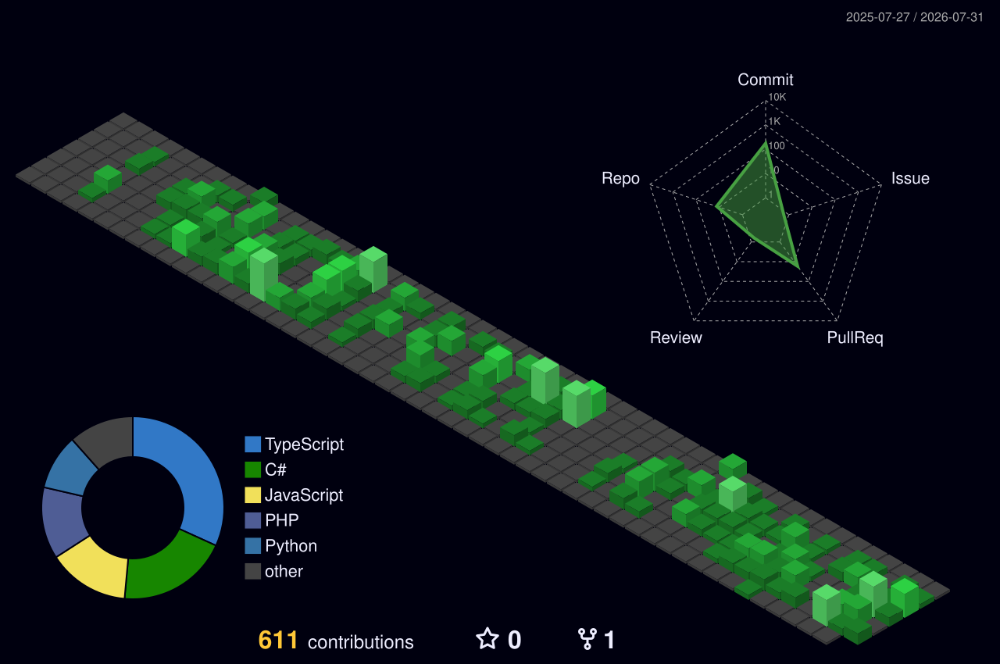

<!-- ===================== HEADER ===================== -->

  

  

   

  
  
  
  

---

<!-- ===================== DASHBOARD 2 COLONNES ===================== -->
<table>
<tr>

<!-- ========== COLONNE GAUCHE ========== -->
<td width="50%" valign="top">

### `>_` Qui suis-je

🧠 Toujours en train d'apprendre, toujours en quête de défis techniques  
💼 Alternant Full-Stack chez **Lamusée Paris** — autonomie totale sur les projets  
🎓 Master Lead Développeur Full-Stack @ **Ensitech**  
🌍 Basé en **Yvelines** · Télétravail ou présentiel  

Je construis des apps web modernes avec **React**, **Next.js**, **Symfony** et **Laravel** — de l'architecture à la prod.

 

### `>_` Stack

**Frontend**

**Backend & Data**

**Outils & DevOps**

 

### `>_` Connect

</td>

<!-- ========== COLONNE DROITE ========== -->
<td width="50%" valign="top">

### `>_` System metrics

<!-- Généré par GitHub Actions (metrics) — s'affiche après le 1er run -->

 

</td>
</tr>
</table>

---

### `>_` Contribution grid · 3D

  

---

### `>_` Contribution snake

  <picture>
    <source media="(prefers-color-scheme: dark)" srcset="https://raw.githubusercontent.com/CHANG-Toma/CHANG-Toma/output/github-contribution-grid-snake-dark.svg" />
    <source media="(prefers-color-scheme: light)" srcset="https://raw.githubusercontent.com/CHANG-Toma/CHANG-Toma/output/github-contribution-grid-snake.svg" />
    
  </picture>

---

  

